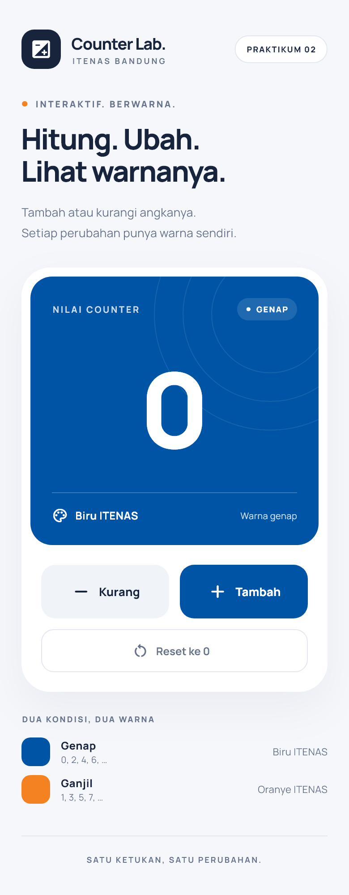
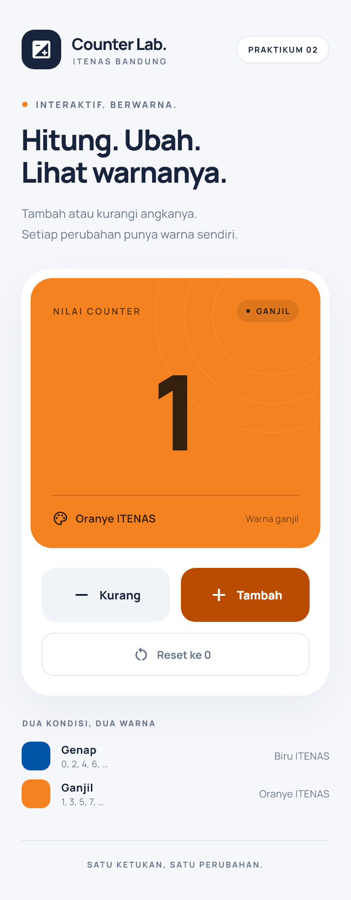

# ITENAS · Counter Lab

Aplikasi Flutter untuk **Praktikum 2 — Anatomi Flutter Widget: StatelessWidget vs StatefulWidget**.

## Fitur sesuai tugas

- **Tambah (+)** menaikkan counter satu angka.
- **Kurang (−)** menurunkan counter satu angka, termasuk ke nilai negatif.
- **Reset ke 0** mengembalikan counter menjadi nol.
- Counter **genap → latar kartu biru ITENAS** (`#0054A6`).
- Counter **ganjil → latar kartu oranye ITENAS** (`#F58220`).
- Nol termasuk genap. Nilai negatif tetap menggunakan aturan yang sama.
- Transisi warna dan angka, tombol berikon dan berlabel, respons sentuhan pada ponsel, serta layout responsif untuk ponsel, landscape, dan browser.
- Font Manrope tersimpan lokal; aplikasi tidak memerlukan koneksi internet saat digunakan.

Warna didefinisikan pada `ItenasColors` di `lib/main.dart` agar mudah disesuaikan.

## Cara menjalankan

Gunakan Flutter **3.47.5** / Dart **3.13.4** atau versi yang kompatibel. Konfigurasi Android menggunakan NDK r30 (`30.0.16248370`), sesuai versi yang terpasang di komputer ini.

```sh
flutter pub get
flutter devices
flutter run
```

Untuk mencoba langsung di Chrome:

```sh
flutter run -d chrome
```

Untuk membuat APK Android:

```sh
flutter build apk --release
```

APK dihasilkan pada `build/app/outputs/flutter-apk/app-release.apk`. Hubungkan ponsel dengan USB debugging atau jalankan emulator untuk menggunakan `flutter run` pada Android. Build iOS memerlukan macOS dan Xcode.

Jika jaringan gagal mengakses artefak pada `storage.googleapis.com`, opsi mirror CFUG yang tercantum dalam [dokumentasi Flutter](https://docs.flutter.dev/community/china) dapat digunakan hanya pada sesi PowerShell build:

```powershell
$env:FLUTTER_STORAGE_BASE_URL = 'https://storage.flutter-io.cn'
flutter build apk --release
```

## Penjelasan kode untuk praktikum

Kode utama berada di **`lib/main.dart`**.

1. **`CounterApp extends StatelessWidget`** menyimpan konfigurasi tema dan layar awal. Widget ini tidak menyimpan nilai counter yang berubah.
2. **`CounterScreen extends StatefulWidget`** adalah konfigurasi immutable dari layar interaktif. `createState()` membuat `_CounterScreenState`.
3. **`initState()`** menginisialisasi `_counter = 0` sekali saat State dibuat.
4. **`_increment()`, `_decrement()`, `_reset()`** mengubah `_counter` di dalam callback sinkron `setState()`. Flutter kemudian menjadwalkan rebuild elemen State terkait.
5. **`_isEven => _counter % 2 == 0`** menentukan kondisi genap/ganjil. Warna dan label dihitung dari nilai yang sama agar konsisten.
6. **`build()`** menyusun UI berdasarkan state terbaru. Tidak ada mutasi state atau pemanggilan `setState()` di dalam `build()`.
7. **`dispose()`** menandai akhir lifecycle. Aplikasi ini tidak memiliki controller, timer, stream, atau listener yang perlu ditutup. Jika resource ditambahkan, bersihkan sebelum `super.dispose()`.

Widget tetap seperti header, dekorasi, panduan warna, dan footer menggunakan `StatelessWidget` serta constructor `const`. `setState()` hanya dipanggil saat interaksi; reset saat nilai sudah nol tidak memicu rebuild tambahan. Animasi menggunakan widget bawaan Flutter sehingga tidak perlu mengelola `AnimationController` secara manual.

Contoh inti perubahan state:

```dart
void _increment() {
  setState(() {
    _counter++;
  });
}

bool get _isEven => _counter % 2 == 0;
```

State counter hanya berlaku selama layar aktif. Menutup dan membuka ulang aplikasi mengembalikan counter ke nol; penyimpanan permanen tidak termasuk tugas ini.

## Pemetaan kriteria penilaian

| Kriteria | Implementasi |
| --- | --- |
| StatefulWidget dan setState — 40% | `CounterScreen`, `_CounterScreenState`, tambah/kurang/reset melalui `setState()` |
| Warna genap/ganjil — 30% | Operator modulo `% 2`, latar `AnimatedContainer`, label GENAP/GANJIL |
| UI rapi dan ikon jelas — 30% | Angka besar, ikon +/−/reset, label tombol, palet konsisten, layout responsif |

## Verifikasi

```sh
flutter analyze
flutter test
flutter build web --no-wasm-dry-run --no-web-resources-cdn
```

Pengujian widget mencakup nilai awal, tambah, kurang, nilai negatif, reset positif/negatif, ketukan cepat, layar kecil, landscape, desktop, dan pembesaran teks.

Hasil pengujian dan konfigurasi build tersedia di [docs/VERIFIKASI.md](docs/VERIFIKASI.md). Setelah clone repository, jalankan `flutter pub get`, kemudian gunakan perintah run atau build di atas. Pada workspace pengerjaan, APK dan ZIP hasil pembuatan tersedia di folder `dist/`.

Font Manrope menggunakan SIL Open Font License; lisensi tersedia di `assets/fonts/OFL.txt`.

## Pratinjau

| Genap: biru | Ganjil: oranye |
| --- | --- |
|  |  |

Untuk merender ulang pratinjau dari widget Flutter, jalankan `flutter test tool/capture_preview.dart`. Ikon aplikasi tersedia untuk Android, iOS, dan web; sumber pembuatannya ada di `tool/generate_icons.py` (memerlukan Pillow).
